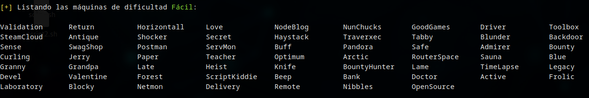
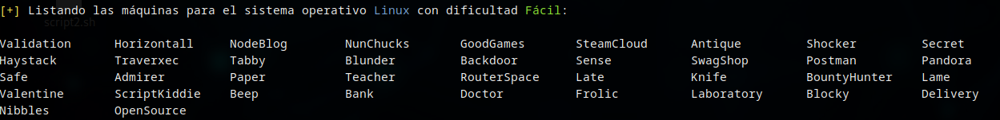
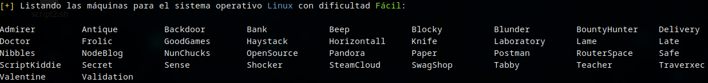
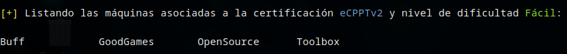

# :scroll: Obtención de listas de máquinas según distintos criterios

La herramienta permite obtener listados de aquellas máquinas que cumplan ciertos criterios de:

* Dificultad, utilizando el parámetro `-d`
* Sistema operativo, utilizando el parámetro `-o`
* Certificación, utilizando el parámetro `-c`

Utilizándola, encontraremos el nombre de todas aquellas máquinas que cumplan con los requisitos establecidos en la ejecución.

Por ejemplo, podremos listar todas aquellas máquinas de dificultad fácil:

### :gear: Comando ejecutado

`./htbmachines -d fácil`

### :page_facing_up: Salida obtenida

---

La búsqueda por dificultad, puede combinarse con la búsqueda por sistema operativo, aplicándose ambos filtros de forma simultánea, como en el siguiente ejemplo:

### :gear: Comando ejecutado

`./htbmachines.sh -d fácil -o Linux`

### :page_facing_up: Salida obtenida

---

Además, podemos aplicar un ordenamiento alfabético a los resultados si añadimos el parámetro `-s`, como podemos ver a continuación:

### :gear: Comando ejecutado

`./htbmachines.sh -d fácil -o Linux -s`

### :page_facing_up: Salida obtenida

---

La búsqueda por dificultad, también puede combinarse con la búsqueda por certificación. En el siguiente ejemplo, listamos de forma ordenada aquellas máquinas de dificultad fácil y que guarden relación con la certificación ecpptv2:

### :gear: Comando ejecutado

`./htbmachines.sh -c ecpptv2 -d fácil -s`

### :page_facing_up: Salida obtenida

## :speech_balloon: Consideraciones finales

La búsqueda combinada de máquinas por certificación y sistema operativo, así como la combinación de estas dos con la búsqueda por dificultad no está implementada.

En caso de no obtener resultados u obtener errores, es posible que no dispongamos del archivo bundle.js, que soporta el funcionamiento de la herramienta. Para obtenerlo, deberemos ejecutar el script con la opción -u.

### :gear: Comando ejecutado

`./htbmachines.sh -u `
