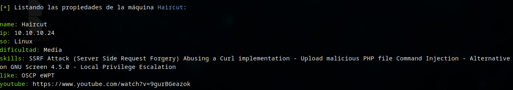

# :mag_right: Búsqueda de una máquina

La herramienta permite obtener las características correspondientes a una máquina a través de su nombre. Para obtener dichas propiedades deberemos ejecutar el script con el parámetro `-m` seguido del nombre de la máquina, como en el siguiente ejemplo:

### :gear: Comando ejecutado

`./htbmachines.sh -m Haircut`

### :page_facing_up: Salida obtenida

---

También podemos buscar una máquina por su dirección ip utilizando el parámetro `-i`. En este caso nos devolverá el nombre asociado a la máquina. Siguiendo el ejemplo de la máquina Haircut:

### :gear: Comando ejecutado

`./htbmachines.sh -i 10.10.10.24`

### :page_facing_up: Salida obtenida

`[+] La máquina con IP 10.10.10.24 es Haircut`

---

Y si quisiéramos únicamente obtener en enlace al vídeo de Youtube con la resolución de la máquina podemos emplear el parámetro -y. Otra vez, con el mismo ejemplo:

### :gear: Comando ejecutado

`./htbmachines.sh -y Haircut`

### :page_facing_up: Salida obtenida

`[+] La resolución de la máquina Haircut puede obtenerse en el siguiente enlace:` https://www.youtube.com/watch?v=9gurBGeazok

## :speech_balloon: Consideraciones finales

En caso de no obtener resultados u obtener errores, es posible que no dispongamos del archivo bundle.js, que soporta el funcionamiento de la herramienta. Para obtenerlo, deberemos ejecutar el script con la opción -u.

### :gear: Comando ejecutado

`./htbmachines.sh -u `
