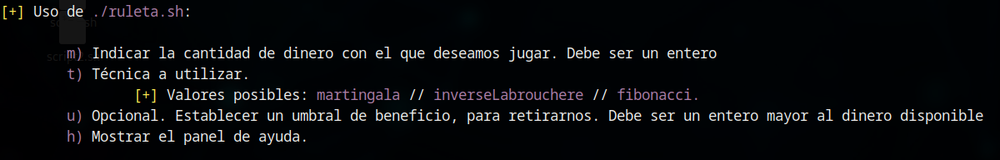

# Visualización del panel de ayuda

El panel de ayuda permite al usuario conocer las opciones disponibles para la ejecución de la herramienta, así como ciertas condiciones que deben cumplir algunos de los parámetros. Puede invocarse empleando la opción -h al ejecutar la herramienta:

`./ruleta.sh -h`

También se muestra de forma automática en caso de que se introduzca alguna información incorrecta, no contemplada, o que no se introduzca ninguna opción.

El contenido del panel es el siguiente:

