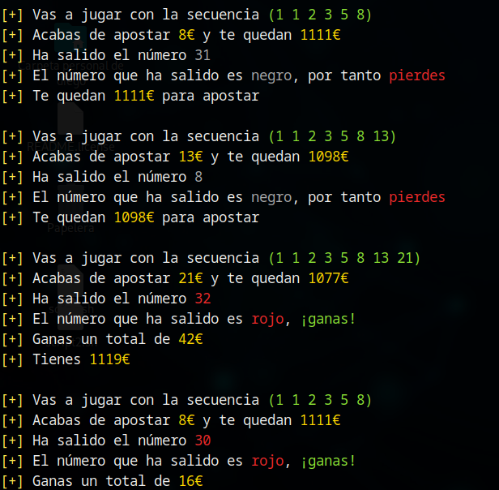

# Estrategia Fibonacci

La estrategia de apuestas de fibonacci es similar a la estrategia de Inverse Labrouchere, ya que en ambas el importe de las apuestas viene determinado por los valores de una secuencia concreta. No obstante, difieren en el modo en el que dicha secuencia va evolucionando. 

Para simular la estrategia de fibonacci, deberemos lanzar la herramienta de la siguiente forma:

`./ruleta.sh -m 1000 -t fibonacci`

## Evolución de la secuencia

En esta estrategia, la secuencia utilizada se basa en la archiconocida sucesión de fibonacci, donde cada elemento es la suma de los dos elementos anteriores, comenzando típicamente por los elementos `0 y 1`, resultando en la sucesión `[0, 1, 1, 2, 3, 5, 8, 13, 21, 34, 55, ...]`. El importe de nuestra apuesta será siempre el último elemento de la secuencia y comenzaremos con la secuencia de un único elemento `[1]`. Supongamos que en un momento dado disponemos de la secuencia `[1, 1, 2, 3, 5, 8]`; nuestra apuesta en este caso sería de `8` euros y la secuencia va evolucionando según las siguientes reglas:

* Si la última apuesta ha resultado perdedora, añadimos a la secuencia la suma de las dos últimas apuestas (los dos últimos elementos de la secuencia). En nuestro ejemplo, sumaríamos `5 + 8 = 13` y el importe de nuestra próxima apuesta sería de 13 euros. 
* Si la última apuesta ha resultado ganadora, los dos últimos elementos de la secuencia son eliminados. En nuestro ejemplo eliminaríamos el `5` y el `8` y la secuencia quedaría como `[1, 1, 2, 3]`, por lo que la siguiente apuesta sería de 3 euros.
* La secuencia mínima es de un único elemento con valor `1` y nunca se reducirá por debajo de esta cantidad de elementos.

## Evolución de las jugadas

Para el correcto funcionamiento de esta estrategia, tras cada jugada debemos actualizar la secuencia, así como el dinero que tenemos disponible. La siguiente imagen ilustra como evoluciona la secuencia tras victorias (eliminando los dos últimos elementos de la secuencia) y derrotas (añadiendo a la secuencia la suma de las dos últimas apuestas):

