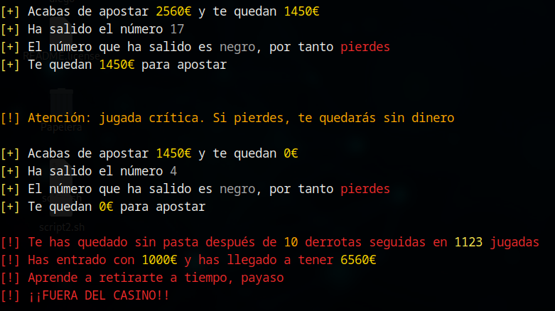
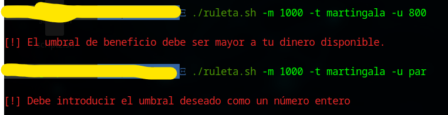
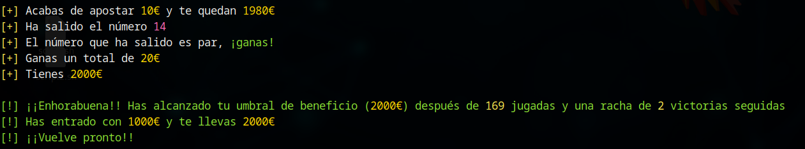
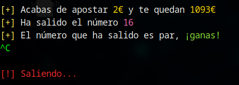

# :end: Fin de la simulación

Para todas las estrategias, existen tres formas de terminar con la simulación y, por tanto, con la ejecución de la herramienta. Estas se describen en los siguientes apartados.

## :chart_with_downwards_trend: Bancarrota

Una vez realizamos la apuesta que nos deja a cero, si esta termina siendo una derrota para nosotros, el sistema lo detectará y nos mostrará un mensaje indicando que ya no podemos jugar más, terminando así en bancarrota y sin posibilidad de seguir apostando. Podemos ver un ejemplo de esta situación en la siguiente imagen, siguiendo la estrategia martingala:

Cabe fijarse en que el mensaje de salida muestra la racha de derrotas, el número total de jugadas, así como la cantidad máxima de dinero que hemos llegado a tener durante la simulación. En este caso hemos llegado a tener `6650€`, que podríamos haber ganado con una retirada a tiempo.

Conviene destacar también la última apuesta realizada. Podemos ver que esta no coincide con el importe que se esperaría de acuerdo a la apuesta anterior. Al perder, debería duplicarse la apuesta, pasando esta a ser de `5120€`; sin embargo, vemos que la apuesta realizada es de `1450€`. Esto ocurre porque la apuesta que en teoría deberíamos realizar es mayor al dinero del que disponemos, así que la herramienta limita la apuesta a nuestro dinero disponible.

## :money_with_wings: Retirada y obtención de beneficios

Se ha implementado un sistema de salida automático al superar cierto umbral de beneficio. Este mecanismo parmite que, si durante el transcurso de las apuestas, superamos este umbral, terminará la partida, reportando beneficios para el jugador. Este umbral está desactivado a no ser que lo especifiquemos al ejecutar la herramienta mediante el parámetro -u, indicando el umbral deseado. Como ejemplo:

### :gear: Comando ejecutado

`./ruleta.sh -m 1000 -t martingala -u 2000`

Este umbral, también contiene mecanismos de validación para asegurar que sea un número natural superior al dinero disponible al entrar, como podemos ver en la siguiente imagen:

Si durante la ejecución superamos dicho umbrar de beneficios, la ejecución terminará con el siguiente mensaje:

En esta ocasión, vemos como nos indica también la cantidad de jugadas totales y la racha de victorias seguidas hasta alcanzar el umbral definido. También nos indica cuál es dicho umbral, así como el dinero con el que salimos del casino tras la simulación (`2000€ en este caso`).

## :o: Interrupción

Cabe destacar, que cualquier ejecución de la herramienta terminará sí o sí con nuestra derrota y expulsión del casino (a no ser que establezcamos un umbral de retirada), ilustrando que independientemente de la estrategia utilizada, el jugador siempre pierde. No obstante, podemos detener la ejecución pulsando la combinación de teclas Ctrl + C, como muestra el siguiente ejemplo:

