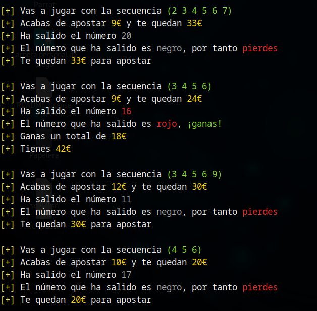

# 🎰 Estrategia Inverse Labrouchere

La estrategia de apuestas de Labrouchere Inversa consiste en el establecimiento de una secuencia inicial que se va actualizando con el transcurso de las jugadas. En este caso solo debemos decidir la apuesta que deseamos realizar (rojo/negro, par/impar) y el importe de la apuesta vendrá definido por los valores de la secuencia en cada jugada. 

Para simular la estrategia de Labrouchere Inversa, deberemos lanzar la herramienta de la siguiente forma:

### :gear: Comando ejecutado

`./ruleta.sh -m 100 -t inverseLabrouchere`

Con el parámetro -m indicaremos la cantidad monetaria de la que disponemos (en euros), mientras que con el parámetro -t especificamos la técnica de apuestas a utilizar. Jugaremos por tanto con 100€ utilizando la estrategia Labrouchere Inversa.

## Evolución de la secuencia

La herramienta funciona en base a la secuencia predeterminada de números `[1, 2, 3, 4]`. El importe de cada apuesta será igual a la suma del primer y último elemento de la secuencia, es decir, la primera apuesta será de `1 + 4 = 5` euros. La secuencia va evolucionando según las siguientes reglas:

* :white_check_mark: Si la última apuesta ha resultado ganadora, el importe de esta se añade al final de la secuencia. En nuestro ejemplo, si la primera apuesta es ganadora, añadiremos el 5 a la secuencia, que quedará como `[1, 2, 3, 4, 5]`; la siguiente apuesta, por tanto, tendrá un importe de `1 + 5 = 6` euros.
* :x: Si la última apuesta ha resultado perdedora, eliminaremos los elementos de la secuencia que han generado la apuesta (el primero y el último). En nuestro ejemplo, eliminaremos los extremos de la secuencia y esta quedará como, `[2, 3]`, resultando la siguiente apuesta en un importe de `2 + 3 = 5` euros.
* :one: Si la secuencia únicamente dispone de un elemento, la apuesta será el doble del valor de dicho elemento. Por ejemplo, si la secuencia es `[7]`, la apuesta será de `2 * 7 = 14` euros.
* :repeat: Si la secuencia se queda sin elementos, se restablecerá la secuencia inicial `[1, 2, 3, 4]`.

## Evolución de las jugadas

Para el correcto funcionamiento de esta estrategia, tras cada jugada debemos actualizar la secuencia, así como el dinero que tenemos disponible. La siguiente imagen ilustra como evoluciona la secuencia tras victorias (añadiendo al final de la secuencia el importe apostado) y derrotas (eliminando los extremos de la secuencia):

### :page_facing_up: Muestra de jugadas consecutivas

