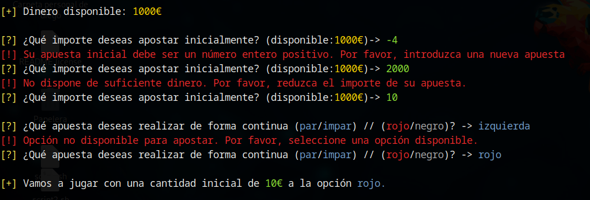
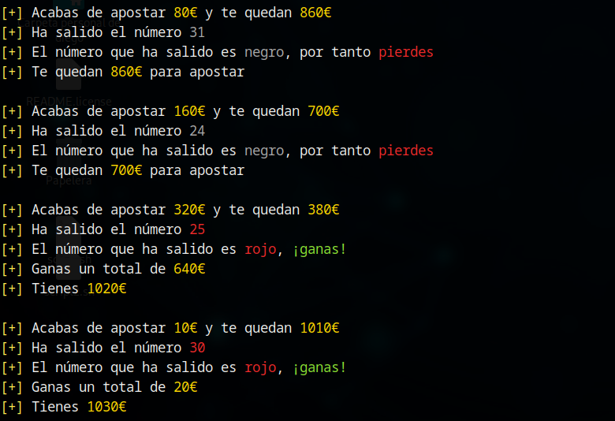

# Estrategia Martingala

La estrategia de apuestas martingala es bastante sencilla. Inicialmente, consiste en definir la cantidad de la apuesta inicial y la apuesta que vamos a realizar (rojo/negro o par/impar). Las siguientes apuestas serán siempre iguales a la inicial, pero el importe irá variando de la siguiente forma:

* Si hemos acertado, la siguiente apuesta será del importe de la apuesta inicial.
* Si hemos fallado, la siguiente apuesta será el doble del importe de la apuesta anterior.

Teniendo esto en cuenta y una vez definido tanto el importe inicial de nuestra apuesta como la apuesta a realizar, la herramienta simulará sucesivas apuestas y tiradas de la ruleta, actualizando tanto el valor de nuestras apuestas como el dinero que tenemos disponible, hasta que nos quedemos sin dinero.

Para simular la estrategia martingala, deberemos lanzar la herramienta de la siguiente forma:

`./ruleta.sh -m 1000 -t martingala`

Con el parámetro -m indicaremos la cantidad monetaria de la que disponemos (en euros), mientras que con el parámetro -t especificamos la técnica de apuestas a utilizar. Jugaremos por tanto con 1000€ utilizando la estrategia Martingala.

## Establecimiento de la apuesta inicial

Como se ha comentado anteriormente, debemos comenzar por establecer el importe inicial de nuestra apuesta y la apuesta que realizaremos. La herramienta contiene mecanismos de validación para asegurar que los parámetros introducidos sean correctos, concretamente:

* Comprobar que la apuesta inicial es un número natural no superior al dinero disponible.
* La apuesta a realizar es una de las cuatro disponibles (rojo/negro, par/impar).

En la siguiente imagen podemos ver un ejemplo del funcionamiento de dichos mecanismos de validación, así como del inicio de las jugadas:

## Evolución de las jugadas

Para el correcto funcionamiento de la estrategia martingala, tras cada jugada debemos actualizar el importe de la siguiente apuesta, así como el dinero que tenemos disponible. La siguiente imagen ilustra como el importe de la apuesta se duplica tras cada derrota y cómo se restablece a la apuesta inicial en el momento en que ganamos una apuesta:

