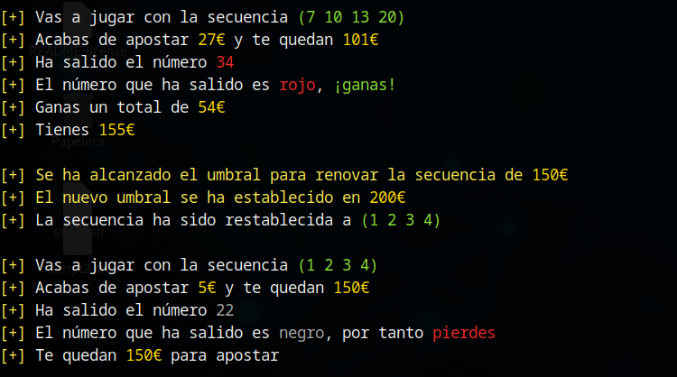
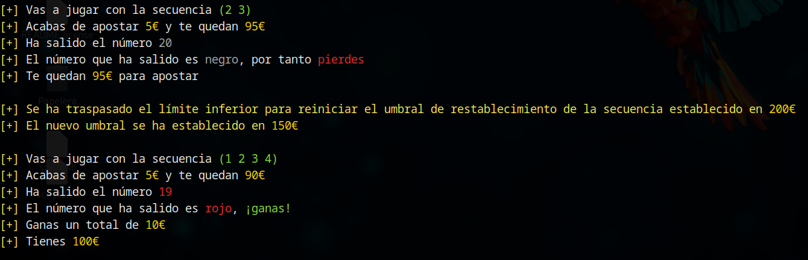

# :repeat: Restablecimiento de la secuencia

Las estrategias Labrouchere Inversa y fibonacci funcionan en base a una secuencia numérica que determina el importe de la apuestya a realizar. Recordemos que:

* Labrouchere Inversa: la secuencia inicial es `[1, 2, 3, 4]` y el importe de la apuesta viene determinado por la suma de los extremos de la secuencia. La secuencia crece si ganamos, añadiendo al final la suma de los dos extremos anteriores, y decrece si perdemos eliminando dichos extremos.
* Fibonacci: la secuencia inicial es `[1]` y el importe de la apuesta viene determinado por el último elemento de la secuencia. La secuencia crede si perdemos, añadiendo al final la suma de las dos últimas apuestas, y decrece si ganamos, eliminando los dos últimos elementos de la secuencia.

## :chart_with_upwards_trend: Umbral de restablecimiento de la secuencia

Para jugar con el beneficio de la casa y evitar realizar apuestas demasiado elevadas, en estas estrategias se ha implementado un mecanismo que restablece la secuencia inicial en caso de superar cierto umbral de beneficio. Este umbral está por defecto establecido en el importe con el que el jugador entra al casino, más 50€ y, en caso de ser superado, se aumenta en otros 50€. La siguiente imagen ilustra el momento en el que se alcanza y actualiza este umbral en la estrategia Inverse Labrouchere:

## :chart_with_downwards_trend: Actualización del umbral a la baja

Para mantener este umbral de forma coherente al dinero disponible en cada momento, este se actualiza también a la baja en el caso de que el dinero del que dispone el jugador sea 100€ inferior (o más) al umbral en dicho momento, como podemos ver en la siguiente imagen, siguiendo la estrategia de Inverse Labrouchere:

Cabe señalar, que la reducción del umbral no implica necesariamente un restablecimiento de la secuencia. En este caso, se produce el restablecimiento porque, tras la derrota, la secuencia se ha quedado sin elementos, no por la actualización del umbral.

## :speech_balloon: Consideraciones finales

Este umbral funciona de forma predeterminada en la herramienta y no puede ser desactivado en la versión actual.